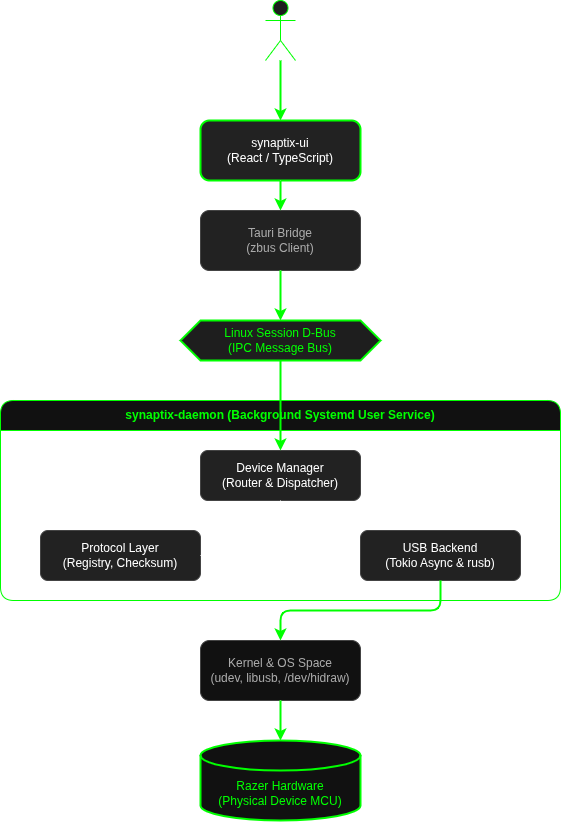

# Synaptix Architecture: A Deep Dive into Razer Hardware Control on Linux

This document provides a low-level mechanical breakdown of how Synaptix translates a user action in a React interface into raw electrical signals on the USB bus to control Razer peripherals.

## 1. High-Level Process Isolation Model

Synaptix utilizes a strict separation of concerns to maximize stability and security. It consists of three primary components:

1.  **`synaptix-ui` (Frontend):** A non-privileged user interface process.
2.  **D-Bus (IPC):** The operating system's standard system bus, acting as the middleware layer.
3.  **`synaptix-daemon` (Backend):** A persistent, asynchronous background process that holds exclusive access to hardware resources.

---

## 2. Low-Level Internal Architecture

This diagram illustrates the internal modular structure of the `synaptix-daemon` and its interactions with standard OS libraries (`libdbus`, `libusb`).



### Component Breakdown

#### A. Crate: `synaptix-protocol`
The architectural "handshake." This shared library contains only data structures (enums, structs) to ensure the UI, Daemon, and Registry agree on the data format.
* **Key File:** `src/lib.rs` (Defines `LightingEffect`, `DeviceCapabilities`).
* **Security:** This crate contains **zero** logic. It simply provides the schema.

#### B. Crate: `synaptix-daemon` (The Core Infrastructure)
This crate is a standard `systemd` user service. It is designed around an asynchronous event loop (Tokio).

1.  **`src/device_manager.rs` (The Router):** This is the central brain. It receives commands from D-Bus, queries the `registry` to validate the device, determines which `razer_protocol` payload is required, and hands the final bytes to the `usb_backend`. It also hosts the Tokio background task for periodic battery polling.
2.  **`src/registry.rs` (The Device Knowledge Base):** Ingests known devices from `openrazer` source code. It maps USB Product IDs (PIDs) to human-readable names and supported capabilities (e.g., "This PID is a DeathAdder V2; it supports static and breathing lighting").
3.  **`src/razer_protocol.rs` (The "Magic" Math):** This is the mechanical engineering layer.
    * It implements the standard Razer 90-byte report format.
    * It contains the critical XOR checksum logic required to bypass Razer's firmware validation. (XORing bytes 2-87, placing the result at byte 88).
    * It contains the response parsers to decode hardware responses (e.g., extracting the battery integer from index 9).
4.  **`src/usb_backend.rs` (The I/O Layer):** A thin wrapper around the `rusb` crate. It opens the physical USB device handles, sets the necessary USB configuration, and executes the raw `control_transfer` writes. It operates strictly on raw byte arrays (`[u8; 90]`).

---

## 3. Standard Razer USB Wire Protocol (Low-Level Payload Format)

Synaptix replicates the standard Razer feature report format. Devices expect a specific 90-byte structure. If the XOR checksum is incorrect, the firmware ignores the command silently.

| Byte Index | Purpose | Typical Value (Static RGB) | Notes |
| :--- | :--- | :--- | :--- |
| **0** | **Report ID** | `0x00` | Standard USB HID report ID. |
| **1** | **Transaction ID** | `0xFF` | Used to map requests to responses. |
| **2-4** | **Reserved** | `0x00 0x00 0x00` | Reserved for future use. |
| **5** | **Data Length** | `0x05` | Length of the actual variable payload data. |
| **6** | **Command Class** | `0x0F` | Broad category (e.g., Lighting, Macros). |
| **7** | **Command ID** | `0x02` | Specific action (e.g., Set Static Color). |
| **8** | **Red** | `0xFF` | Lighting data. |
| **9** | **Green** | `0x00` | Lighting data (or battery response index). |
| **10** | **Blue** | `0x00` | Lighting data. |
| **...** | **Padding** | `0x00` | Padding to reach required length. |
| **88** | **XOR Checksum** | `0xXY` | Critical validation. XOR result of indices 2 through 87. |
| **89** | **End Marker** | `0x00` | Required terminator. |

---

## 4. Hardware Access and Security Model (`udev`)

A critical SRE requirement is security. `synaptix-daemon` runs under a regular user account, yet it must access hardware nodes (`/dev/bus/usb/...`) typically owned by `root`.

We solve this using **deterministic udev rule application** rather than requiring `sudo`.

1.  **The Rule (`99-synaptix.rules`):** Installed during the `.deb` installation process to `/etc/udev/rules.d/`.
    ```udev
    SUBSYSTEM=="usb", ATTR{idVendor}=="1532", MODE="0660", GROUP="plugdev", TAG+="uaccess"
    ```
2.  **The Execution Flow:**
    1.  The `.deb` installer copies the rule.
    2.  The `.deb` post-install script runs `udevadm trigger`.
    3.  The Linux Kernel's udev subsystem detects all connected Razer devices (`1532`).
    4.  It applies the rules, granting read/write (`0660`) permissions to the `plugdev` group and the current console user (`uaccess`).
    5.  The `synaptix-daemon` (running as the console user) can now successfully use `libusb` to open the hardware handle without escalation.