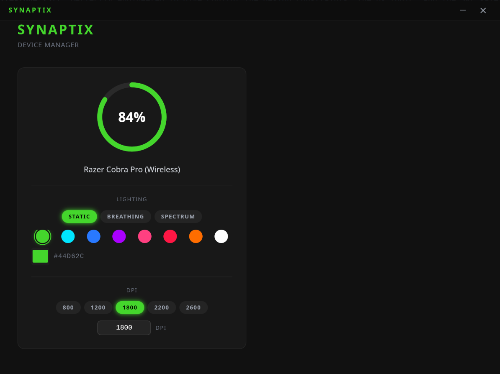

<div align="center">

# Synaptix


**A modern, open-source replacement for Razer Synapse on Linux.**

Synaptix is a Rust-powered daemon and GUI that replaces the [`openrazer`](https://github.com/openrazer/openrazer) + Polychromatic stack with a clean, event-driven architecture built from the ground up.

[](https://github.com/Zenardi/Synaptix/actions/workflows/ci.yml)
[](./LICENSE)
[](https://www.rust-lang.org/)
[](https://tauri.app/)

</div>



---

## ⚠️ Project Status

> [!WARNING] 
> This project is under active development and is not yet production-ready.
>
> Hardware communication is implemented via raw USB and has only been tested on the devices listed below. Unexpected behaviour — including potential firmware interaction issues — may occur on untested hardware. **Use at your own risk**, especially when running the daemon with elevated USB permissions.
>
> Contributions, bug reports, and hardware compatibility feedback are very welcome.

---

## Table of Contents

- [Synaptix](#synaptix)
  - [⚠️ Project Status](#️-project-status)
  - [Table of Contents](#table-of-contents)
  - [Features](#features)
  - [Architecture](#architecture)
    - [Data flow](#data-flow)
  - [Pre-requisites](#pre-requisites)
    - [System packages](#system-packages)
    - [Rust](#rust)
    - [Node.js \& npm](#nodejs--npm)
    - [Tauri CLI](#tauri-cli)
  - [Local Setup](#local-setup)
  - [Running in Development](#running-in-development)
    - [1 — Start the daemon](#1--start-the-daemon)
    - [2 — Start the UI](#2--start-the-ui)
  - [Running Tests](#running-tests)
    - [Rust (all crates)](#rust-all-crates)
    - [React / TypeScript](#react--typescript)
    - [Watch mode (frontend)](#watch-mode-frontend)
  - [Building for Production](#building-for-production)
    - [Daemon binary](#daemon-binary)
    - [Tauri application (UI)](#tauri-application-ui)
  - [Installing the Daemon](#installing-the-daemon)
    - [Manual (development)](#manual-development)
    - [systemd user service (recommended)](#systemd-user-service-recommended)
  - [USB Permissions (udev)](#usb-permissions-udev)
  - [Supported Devices](#supported-devices)
    - [Hardware-Tested](#hardware-tested)
    - [Full Device Coverage](#full-device-coverage)
      - [Mice (103 PIDs)](#mice-103-pids)
      - [Keyboards (106 PIDs)](#keyboards-106-pids)
    - [Adding a new device](#adding-a-new-device)
  - [Contributing](#contributing)
    - [Workflow](#workflow)
    - [Code style](#code-style)
  - [License](#license)

---

## Features

- 🖱️ **Real hardware communication** — writes RGB payloads directly to Razer devices via raw USB (no kernel module required).
- 📡 **Event-driven D-Bus architecture** — the daemon broadcasts `BatteryChanged` signals; the UI reacts instantly without polling.
- 🎨 **Synapse-inspired UI** — frameless dark window with animated glowing battery rings and a per-device RGB color picker.
- ⚡ **Battery-aware polling** — hardware is only queried once per minute, and the D-Bus signal is suppressed when the value has not changed, preserving the mouse's wireless sleep state.
- 🧪 **Strictly TDD** — every layer (protocol types, daemon logic, USB payload math, React components) was built test-first.

---

## Architecture

Synaptix is a Cargo workspace with three decoupled crates:

```
Synaptix/
├── crates/
│   ├── synaptix-protocol/   # Shared Rust types (RazerDevice, BatteryState, LightingEffect)
│   ├── synaptix-daemon/     # Headless service: USB ↔ D-Bus bridge
│   └── synaptix-ui/         # Tauri app: D-Bus client + React/TypeScript frontend
└── Cargo.toml               # Workspace root
```

### Data flow

```
Physical Hardware
      │  rusb (USB control transfer)
      ▼
synaptix-daemon  ──── D-Bus (zbus) ────►  synaptix-ui (Tauri)
  org.synaptix.Daemon                         │  Tauri IPC (invoke/emit)
  /org/synaptix/Daemon                        ▼
                                         React Frontend
```

| Crate | Role | Key dependencies |
|---|---|---|
| `synaptix-protocol` | Shared data contracts | `serde` |
| `synaptix-daemon` | Hardware backend & D-Bus server | `rusb`, `zbus`, `tokio` |
| `synaptix-ui` | GUI & D-Bus client | `tauri v2`, `zbus`, React, Tailwind, Framer Motion |

---

## Pre-requisites

### System packages

```bash
# Debian / Ubuntu / Pop!_OS
sudo apt install -y \
    libdbus-1-dev \
    libusb-1.0-0-dev \
    pkg-config \
    build-essential \
    libwebkit2gtk-4.1-dev \
    libgtk-3-dev \
    libayatana-appindicator3-dev \
    librsvg2-dev
```

### Rust

Install the stable toolchain via [rustup](https://rustup.rs/):

```bash
curl --proto '=https' --tlsv1.2 -sSf https://sh.rustup.rs | sh
rustup update stable
```

Required version: **1.75 or later** (`rustup show`).

### Node.js & npm

Required to build the React frontend. The recommended version is **Node 20 LTS**:

```bash
# via nvm (recommended)
nvm install 20 && nvm use 20

# or via system package manager
sudo apt install -y nodejs npm
```

### Tauri CLI

```bash
cargo install tauri-cli --version "^2" --locked
```

---

## Local Setup

```bash
# 1. Clone the repository
git clone https://github.com/<your-org>/Synaptix.git
cd Synaptix

# 2. Install Rust dependencies (workspace)
cargo fetch

# 3. Install frontend dependencies
cd crates/synaptix-ui
npm install
cd ../..
```

---

## Running in Development

Synaptix requires **two processes** to be running simultaneously: the daemon backend and the Tauri UI.

### 1 — Start the daemon

Open a terminal and run:

```bash
cargo run -p synaptix-daemon
```

You should see:

```
Synaptix Daemon running on org.synaptix.Daemon at /org/synaptix/Daemon
```

The daemon will emit a `BatteryChanged` D-Bus signal once per minute (only when the level changes).

### 2 — Start the UI

Open a second terminal and run:

```bash
cd crates/synaptix-ui
npm run tauri dev
```

Vite serves the React frontend at `http://localhost:5173` and Tauri wraps it in a frameless native window. Hot-module replacement (HMR) is active — React changes reflect instantly.

> **Note:** The daemon must be running before you open the UI, otherwise the D-Bus proxy will fail to connect and no devices will be displayed.

---

## Running Tests

### Rust (all crates)

```bash
cargo test --workspace
```

Expected output: **9 tests pass** across `synaptix-daemon` (7) and `synaptix-protocol` (2).

### React / TypeScript

```bash
cd crates/synaptix-ui
npm test
```

Tests are run with **Vitest** and **@testing-library/react**. Tauri APIs are automatically mocked.

### Watch mode (frontend)

```bash
cd crates/synaptix-ui
npm run test:watch
```

---

## Building for Production

### Daemon binary

```bash
cargo build --release -p synaptix-daemon
# Output: target/release/synaptix-daemon
```

### Tauri application (UI)

```bash
cd crates/synaptix-ui
npm run tauri build
```

This compiles the Rust Tauri shell and bundles the Vite-built React app. Outputs depend on your platform:

| Platform | Output location | Format |
|---|---|---|
| Linux | `target/release/bundle/deb/` | `.deb` package |
| Linux | `target/release/bundle/appimage/` | `.AppImage` |
| Linux | `target/release/synaptix-ui` | Raw binary |

> **Note:** Bundling is currently disabled (`"bundle": { "active": false }` in `tauri.conf.json`). To enable it, set `"active": true` before running `tauri build`.

---

## Installing the Daemon

### Manual (development)

Copy the release binary to a location on your `$PATH`:

```bash
sudo cp target/release/synaptix-daemon /usr/local/bin/synaptix-daemon
```

### systemd user service (recommended)

Create the service unit file:

```bash
mkdir -p ~/.config/systemd/user
cat > ~/.config/systemd/user/synaptix-daemon.service << 'EOF'
[Unit]
Description=Synaptix Razer Device Daemon
After=graphical-session.target

[Service]
ExecStart=/usr/local/bin/synaptix-daemon
Restart=on-failure
RestartSec=5

[Install]
WantedBy=default.target
EOF
```

Enable and start it:

```bash
systemctl --user daemon-reload
systemctl --user enable --now synaptix-daemon
systemctl --user status synaptix-daemon
```

---

## USB Permissions (udev)

By default, Linux restricts raw USB access to root. To allow Synaptix to communicate with Razer hardware as a normal user, install the provided udev rule:

```bash
sudo tee /etc/udev/rules.d/99-synaptix.rules << 'EOF'
# Razer devices — allow plugdev group access for Synaptix
SUBSYSTEM=="usb", ATTRS{idVendor}=="1532", MODE="0664", GROUP="plugdev"
EOF

# Reload rules and re-trigger
sudo udevadm control --reload-rules
sudo udevadm trigger

# Add your user to the plugdev group (log out and back in after this)
sudo usermod -aG plugdev $USER
```

Verify membership with `groups`. If `plugdev` is listed, you can run the daemon without `sudo`.

---

## Supported Devices

Synaptix supports **209+ Razer peripherals** across mice and keyboards. When a supported device is plugged in, the daemon automatically identifies it via USB PID, exposes it on D-Bus, and the UI displays it with its correct name and capabilities.

> **Full lighting and battery control** is currently implemented and hardware-tested for a subset of devices (see table below). For all other supported devices, identification and D-Bus exposure work correctly — extended control features will be enabled as protocol parameters are mapped and contributors test on real hardware.

### Hardware-Tested

| Device | Wired PID | Wireless PID | Static RGB | Battery Reporting |
|---|---|---|---|---|
| Razer Cobra Pro | `0x00AF` | `0x00B0` | ✅ Tested | ✅ Tested |
| Razer DeathAdder V2 Pro | `0x007C` | `0x007D` | ✅ Implemented | 🔄 Untested |

**Legend:** ✅ Verified on real hardware &nbsp;|&nbsp; 🔄 Protocol mapped, needs hardware confirmation

---

### Full Device Coverage

All 209+ devices below are recognized by the daemon out of the box.

#### Mice (103 PIDs)

| Family | Notable Models |
|---|---|
| **Abyssus** | Abyssus, 1800, 2000, Essential, V2, Elite D.Va Edition |
| **Atheris** | Atheris (Receiver) |
| **Basilisk** | Basilisk, Essential, X HyperSpeed, V2, Ultimate, V3, V3 Pro, V3 X HyperSpeed, V3 35K, V3 Pro 35K, V3 Pro 35K Phantom Green |
| **Cobra** | Cobra, Cobra Pro (Wired/Wireless) |
| **DeathAdder** | 3.5G, 2013, 1800, Chroma, Elite, Essential, V2, V2 Mini, V2 Lite, V2 Pro, V2 X HyperSpeed, V3, V3 Pro, V3 HyperSpeed, V4 Pro |
| **Diamondback** | Diamondback Chroma |
| **Imperator** | Imperator |
| **Lancehead** | Lancehead (Wired/Wireless), Lancehead Wireless, Lancehead TE |
| **Mamba** | Mamba 2012, Mamba Chroma, Mamba TE, Mamba Elite, Mamba Wireless |
| **Naga** | Naga, Naga 2012/2014, Naga Chroma, Naga Hex (V2), Naga Epic Chroma, Naga Trinity, Naga X, Naga Pro, Naga V2 Pro, Naga V2 HyperSpeed, Naga Left-Handed 2020 |
| **Orochi** | Orochi 2011/2013, Orochi (Wired), Orochi V2 |
| **Ouroboros** | Ouroboros |
| **Pro Click** | Pro Click, Pro Click Mini, Pro Click V2, Pro Click V2 Vertical |
| **Taipan** | Taipan |
| **Viper** | Viper, Viper 8KHz, Viper Mini, Viper Mini SE, Viper Ultimate, Viper V2 Pro, Viper V3 HyperSpeed, Viper V3 Pro |

#### Keyboards (106 PIDs)

| Family | Notable Models |
|---|---|
| **Anansi** | Anansi |
| **BlackWidow** | Ultimate 2012/2013/2016, Stealth, Chroma (V2), TE Chroma, X Chroma, Elite, Lite, Essential, 2019, V3, V3 Pro, V3 Mini HyperSpeed, V3 TKL, V4, V4 Pro, V4 75%, V4 X, V4 Mini HyperSpeed, V4 TKL HyperSpeed |
| **Cynosa** | Cynosa Chroma, Cynosa Chroma Pro, Cynosa Lite, Cynosa V2 |
| **DeathStalker** | Expert, Essential, Chroma, V2, V2 Pro, V2 Pro TKL |
| **Huntsman** | Huntsman, Huntsman Elite, Huntsman TE, Huntsman Mini (Analog/JP), Huntsman V2 (Analog/TKL), Huntsman V3 Pro (TKL/Mini/8KHz) |
| **Nostromo / Tartarus / Orbweaver** | Nostromo, Tartarus, Tartarus Chroma, Tartarus V2, Tartarus Pro, Orbweaver, Orbweaver Chroma |
| **Ornata** | Ornata, Ornata Chroma, Ornata V2, Ornata V3 (X/TKL) |
| **Razer Blade** | Blade Stealth (2016–2020), Blade QHD, Blade 15 (2018–2025), Blade 16 (2023/2025), Blade 17 Pro (2021), Blade 18 (2023–2025), Blade 14 (2021–2025), Blade Pro (2016–2020), Book 2020 |

### Adding a new device

1. Add its PIDs and display name to `get_device_profile()` in `crates/synaptix-protocol/src/registry.rs`.
2. Add its `(transaction_id, led_id)` entry to `lighting_params()` in `crates/synaptix-daemon/src/device_manager.rs`.
3. If it needs battery polling, add it to the loop in `main.rs`.
4. Open a PR with the hardware model and PID source.

> [!TIP]
> See the detailed contributor guide: [ADD_NEW_DEVICES.md](./ADD_NEW_DEVICES.md)

---

## Contributing

Contributions are welcome. Please follow the development rules below to keep the architecture clean.

### Workflow

1. **Fork** the repository and create a feature branch: `git checkout -b feat/my-feature`.
2. **Follow TDD strictly** — write failing tests first, then implement.
3. **Update `synaptix-protocol` first** when defining any new type or D-Bus message, then implement in the daemon, then the UI.
4. **Never put hardware logic in the Tauri app.** USB communication is the exclusive domain of `synaptix-daemon`.
5. Ensure `cargo test --workspace` and `npm test` both pass before opening a PR.
6. Open a Pull Request against `main` with a clear description of the change.

### Code style

- Rust: `cargo fmt` and `cargo clippy -- -D warnings` must produce no errors.
- TypeScript: Follow the existing Tailwind + Framer Motion patterns in `crates/synaptix-ui/src/`.
- Comments: Only where clarification is genuinely needed — avoid noise.

---

## License

[MIT](./LICENSE) © 2026 Eduardo Zenardi


---

The project is licensed under the MIT and is not officially endorsed by [Razer, Inc](http://www.razer.com/).